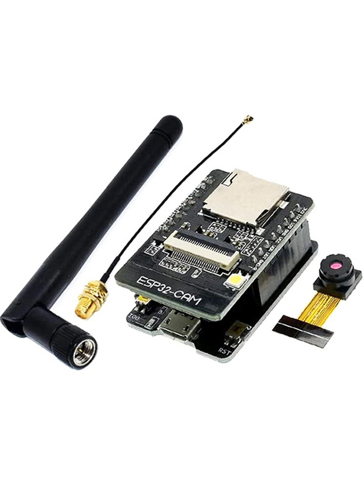
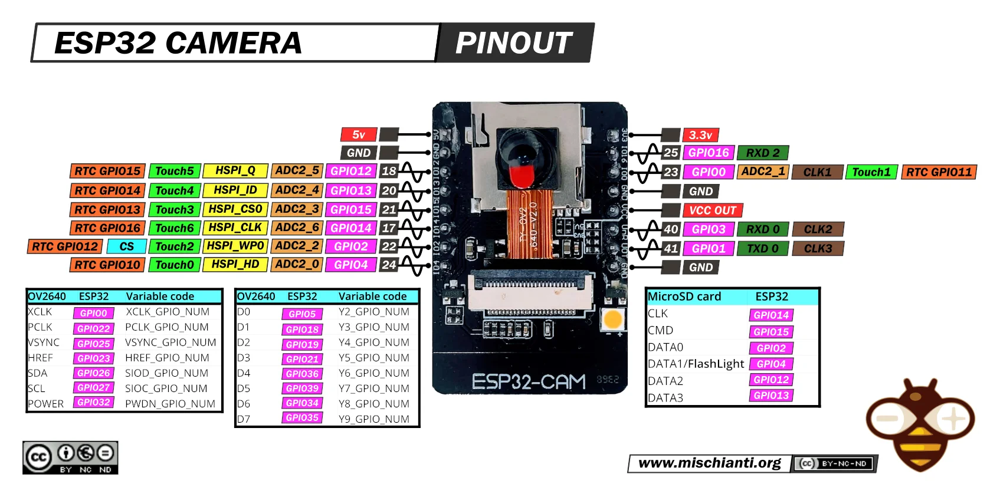
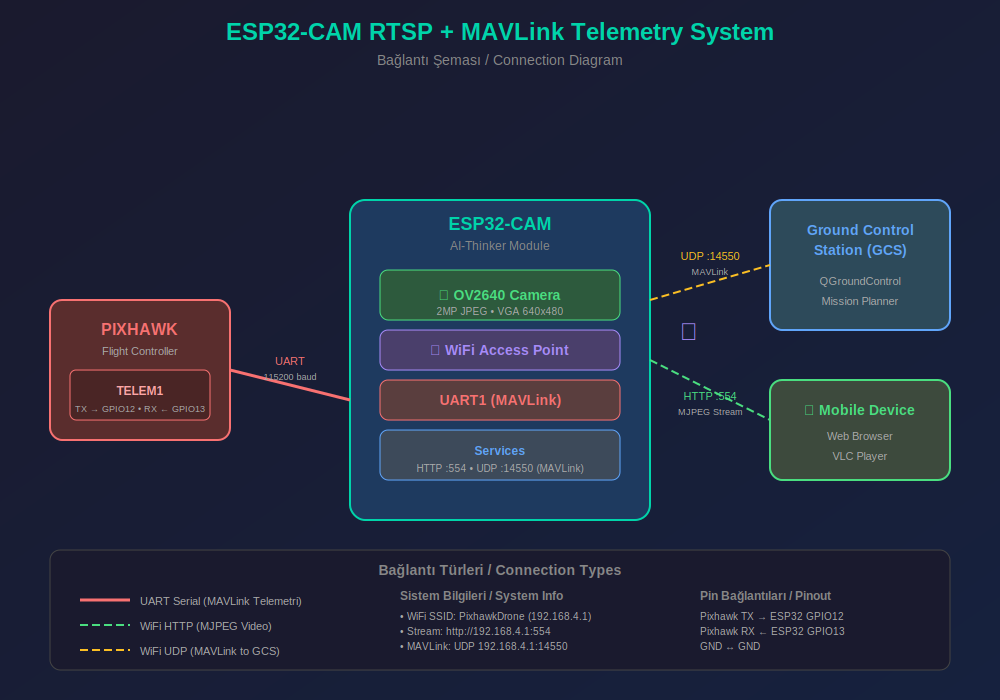

# ESP32-CAM RTSP Streamer + MAVLink Telemetry

ESP32-CAM üzerindeki OV2640 kameradan görüntü alıp WiFi Access Point üzerinden MJPEG HTTP streaming ile yayınlayan ve aynı zamanda Pixhawk'tan MAVLink telemetri verilerini GCS'ye ileten embedded sistem projesi.

## 🎯 Özellikler

- **OV2640 Kamera**: 2MP dahili kamera, JPEG donanım kodlama
- **WiFi Access Point**: 192.168.4.0/24 subnet'inde hotspot oluşturur
- **MJPEG HTTP Streaming**: Tarayıcı ve VLC uyumlu video stream
- **MAVLink Telemetri**: Pixhawk <-> GCS köprüsü (UDP 14550)
- **Çift Yönlü İletişim**: GCS komutları Pixhawk'a iletilir
- **Çoklu İstemci**: Aynı anda 4 video + 4 GCS istemcisi
- **Flash LED**: GPIO4 ile kontrol edilebilir aydınlatma
- **4MB PSRAM**: Yüksek çözünürlük desteği

## 📷 Donanım

### ESP32-CAM Modülü



**Özellikler:**
- ESP32-S (Dual-core 240MHz)
- 4MB Flash + 4MB PSRAM
- OV2640 2MP Kamera (dahili)
- MicroSD kart yuvası
- Flash LED (GPIO4)
- Harici anten seçeneği

### ESP32-CAM Pinout



### Sistem Diyagramı



### Bağlantı Şeması

```
ESP32-CAM                   Pixhawk (TELEM1/TELEM2)
---------                   -----------------------
GPIO1 (U0TXD) ------------>  RX
GPIO3 (U0RXD) <------------  TX
GND           <----------->  GND

ESP32-CAM                   USB-TTL (Programlama için)
---------                   ------------------------
U0T (GPIO1)  ------------->  RX
U0R (GPIO3)  <-------------  TX
5V           <------------>  5V
GND          <------------>  GND
IO0          -----> GND      (Sadece programlama modunda)
```

> ⚠️ **Programlama Sonrası IO0-GND bağlantısını kaldırın!**
> ⚠️ Pixhawk ile 3.3V sinyal seviyesi uyumludur, level shifter gerekmez.
> ⚠️ **GPIO1/GPIO3 USB-TTL programlama ile paylaşımlıdır.** Programlama yaparken Pixhawk bağlantısını kesin!

### Pin Mapping

| Pin | Fonksiyon | Açıklama |
|-----|-----------|----------|
| GPIO0 | XCLK | Kamera clock |
| GPIO5 | D0 | Kamera data |
| GPIO18 | D1 | Kamera data |
| GPIO19 | D2 | Kamera data |
| GPIO21 | D3 | Kamera data |
| GPIO36 | D4 | Kamera data |
| GPIO39 | D5 | Kamera data |
| GPIO34 | D6 | Kamera data |
| GPIO35 | D7 | Kamera data |
| GPIO25 | VSYNC | Kamera sync |
| GPIO23 | HREF | Kamera sync |
| GPIO22 | PCLK | Kamera clock |
| GPIO26 | SDA | Kamera I2C |
| GPIO27 | SCL | Kamera I2C |
| GPIO32 | PWDN | Kamera power |
| GPIO4 | FLASH | Flash LED |
| GPIO33 | LED | Dahili LED |
| GPIO1 | U0TXD | MAVLink TX → Pixhawk RX |
| GPIO3 | U0RXD | MAVLink RX ← Pixhawk TX |
| GPIO12 | HS2_DATA2 | SD Card (HSPI) |
| GPIO13 | HS2_DATA3 | SD Card (HSPI) |

## 📡 Ağ Yapılandırması

| Parametre | Değer |
|-----------|-------|
| SSID | PixhawkDrone |
| Şifre | 12345678 |
| Gateway IP | 192.168.4.1 |
| Subnet Mask | 255.255.255.0 |
| DHCP Aralığı | 192.168.4.100 - 192.168.4.200 |
| HTTP Stream Port | 554 |
| Stream URL | http://192.168.4.1:554 |
| MAVLink UDP | 14550 |

## 🚀 Kurulum

### 1. Gereksinimler

- [PlatformIO](https://platformio.org/) (VSCode eklentisi önerilir)
- ESP32-CAM modülü
- USB-TTL adaptör (FT232RL, CP2102, CH340) **veya** ESP32-CAM-MB

### 2. Projeyi Klonlayın

```bash
git clone https://github.com/maren-robotics/esp32cam-rtsp-mavlink.git
cd esp32cam-rtsp-mavlink
```

### 3. Derleyin ve Yükleyin

**Programlama Bağlantısı (USB-TTL ile):**
```
ESP32-CAM    USB-TTL
---------    -------
5V      -->  5V
GND     -->  GND
U0T     -->  RX
U0R     -->  TX
IO0     -->  GND  (programlama modunda)
```

**PlatformIO ile:**
```bash
# Derleme
pio run

# Yükleme (IO0-GND bağlıyken RST'ye basın)
pio run --target upload

# Serial monitor
pio device monitor
```

> 💡 **ESP32-CAM-MB** adaptörünüz varsa, sadece USB takıp yükleyebilirsiniz.

## 📺 Kullanım

### 1. ESP32-CAM'i Başlatın

Cihaz başladığında serial monitörde şunları göreceksiniz:

```
========================================
   ESP32-CAM RTSP + MAVLink System
========================================
Free heap: 267120 bytes
WiFi AP: PixhawkDrone
IP: 192.168.4.1
MAVLink: UDP port 14550
RTSP: http://192.168.4.1:554
Camera: OV2640 VGA 15fps
========================================
System ready!
```

### 2. WiFi'ye Bağlanın

Telefonunuz veya bilgisayarınızdan **PixhawkDrone** ağına bağlanın.
- Şifre: `12345678`

### 3. Stream'i İzleyin

**Web Tarayıcı ile:**
```
http://192.168.4.1:554
```

**VLC Media Player ile:**
```
Media > Open Network Stream
URL: http://192.168.4.1:554
```

**FFplay ile:**
```bash
ffplay http://192.168.4.1:554
```

**OpenCV (Python) ile:**
```python
import cv2

cap = cv2.VideoCapture('http://192.168.4.1:554')
while True:
    ret, frame = cap.read()
    if ret:
        cv2.imshow('ESP32-CAM', frame)
    if cv2.waitKey(1) & 0xFF == ord('q'):
        break
cap.release()
```

### 4. QGroundControl ile Telemetri

1. QGroundControl'u açın
2. Application Settings > Comm Links
3. "Add" butonuna tıklayın
4. Ayarlar:
   - Name: ESP32-Pixhawk
   - Type: UDP
   - Port: 14550
5. "Connect" butonuna tıklayın

**Mission Planner ile:**
1. Sağ üstteki bağlantı kutusundan "UDP" seçin
2. Port: 14550
3. "Connect" butonuna tıklayın

## ⚙️ Yapılandırma

`platformio.ini` dosyasında:

```ini
build_flags = 
    ; WiFi AP ayarları
    -DWIFI_AP_SSID=\"MyDrone\"
    -DWIFI_AP_PASS=\"mypassword123\"
    -DWIFI_AP_CHANNEL=6
    
    ; Kamera ayarları (VGA önerilir)
    ; FRAMESIZE_VGA (640x480)
    ; FRAMESIZE_SVGA (800x600)
    ; FRAMESIZE_XGA (1024x768)
    ; FRAMESIZE_HD (1280x720)
    
    ; MAVLink ayarları
    -DMAVLINK_UART_TX_PIN=1
    -DMAVLINK_UART_RX_PIN=3
    -DMAVLINK_UART_BAUD=115200
    -DMAVLINK_UDP_PORT=14550
```

### Pixhawk TELEM Port Ayarları

**ArduPilot (Mission Planner):**
```
SERIAL1_PROTOCOL = 2 (MAVLink2)
SERIAL1_BAUD = 115
```

**PX4 (QGroundControl):**
```
MAV_0_CONFIG = TELEM1
SER_TEL1_BAUD = 115200
```

## 📊 Performans

| Çözünürlük | FPS | Bant Genişliği | Notlar |
|------------|-----|----------------|--------|
| QQVGA (160x120) | 30 | ~0.5 Mbps | Düşük gecikme |
| QVGA (320x240) | 30 | ~1 Mbps | Dengeli |
| VGA (640x480) | 15-25 | ~2-3 Mbps | **Önerilen** |
| SVGA (800x600) | 12-15 | ~3-4 Mbps | İyi kalite |
| XGA (1024x768) | 8-12 | ~4-5 Mbps | Yüksek kalite |
| HD (1280x720) | 5-8 | ~5-6 Mbps | PSRAM gerekli |

## 🔧 Sorun Giderme

### Kamera başlatılamıyor
- Kamera ribbon kablosunun düzgün takıldığından emin olun
- Konnektörün kilidinin kapalı olduğunu kontrol edin
- `Camera init failed` hatası alıyorsanız ribbon kabloyu çıkarıp tekrar takın

### Stream açılmıyor
- WiFi bağlantısını kontrol edin: `ping 192.168.4.1`
- Tarayıcıda `http://192.168.4.1:554` açın
- Firewall ayarlarını kontrol edin

### Düşük FPS
- Çözünürlüğü VGA (640x480) veya altına düşürün
- JPEG quality değerini artırın (10-63, düşük=daha iyi kalite ama daha büyük dosya)
- Tek istemci ile test edin

### Pixhawk bağlanmıyor
- TX/RX kablolarının çapraz bağlandığından emin olun (ESP32 TX → Pixhawk RX)
- Baud rate'in eşleştiğini kontrol edin (115200)
- GND bağlantısını kontrol edin
- Programlama sırasında Pixhawk bağlantısını kesin (GPIO1/3 paylaşımlı)

### Programlama hatası
- IO0 pinin GND'ye bağlı olduğundan emin olun
- RST butonuna basın veya güç döngüsü yapın
- Upload başlamadan önce "Connecting..." mesajını bekleyin
- Pixhawk bağlantısını kesin (GPIO1/3 USB-TTL ile paylaşımlı)

## 📁 Proje Yapısı

```
esp32cam-rtsp-mavlink/
├── include/
│   ├── wifi_ap.h             # WiFi AP modülü
│   ├── ov2640_camera.h       # OV2640 kamera modülü
│   ├── rtsp_server.h         # HTTP MJPEG server
│   └── mavlink_telemetry.h   # MAVLink köprü modülü
├── src/
│   ├── main.c                # Ana uygulama
│   ├── wifi_ap.c             # WiFi implementasyonu
│   ├── ov2640_camera.c       # Kamera implementasyonu
│   ├── rtsp_server.c         # MJPEG server implementasyonu
│   ├── mavlink_telemetry.c   # MAVLink implementasyonu
│   ├── idf_component.yml     # esp32-camera bağımlılığı
│   └── CMakeLists.txt        # Build config
├── platformio.ini            # PlatformIO yapılandırması
├── sdkconfig.defaults        # ESP-IDF varsayılanları
├── esp32_cam.jpg             # Donanım resmi
├── esp32_cam_rtsp_diagram.svg # Sistem diyagramı
└── README.md                 # Bu dosya
```

## 📜 Lisans

MIT License - Özgürce kullanın ve geliştirin!

## 🤝 Katkıda Bulunma

1. Fork yapın
2. Feature branch oluşturun (`git checkout -b feature/amazing`)
3. Commit yapın (`git commit -m 'Add amazing feature'`)
4. Push yapın (`git push origin feature/amazing`)
5. Pull Request açın

## 📚 Referanslar

- [ESP32-CAM Datasheet](https://docs.ai-thinker.com/esp32-cam)
- [ESP-IDF Programming Guide](https://docs.espressif.com/projects/esp-idf/en/latest/)
- [esp32-camera Library](https://github.com/espressif/esp32-camera)
- [MAVLink Protocol](https://mavlink.io/en/)
