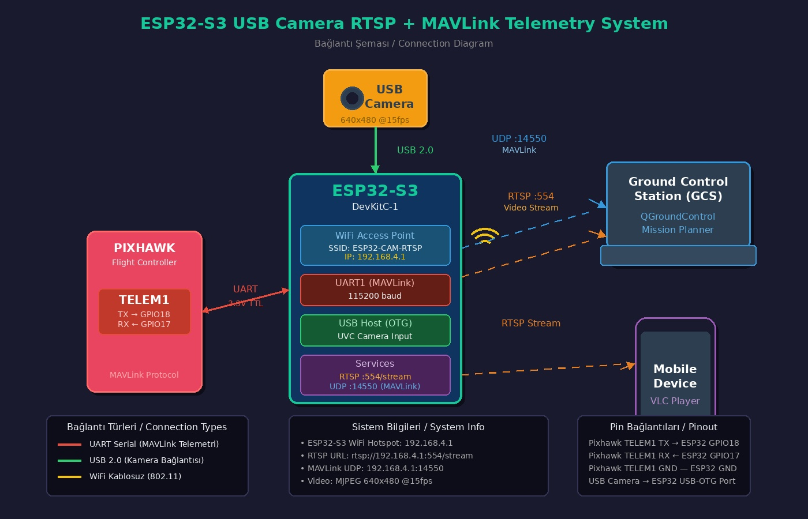
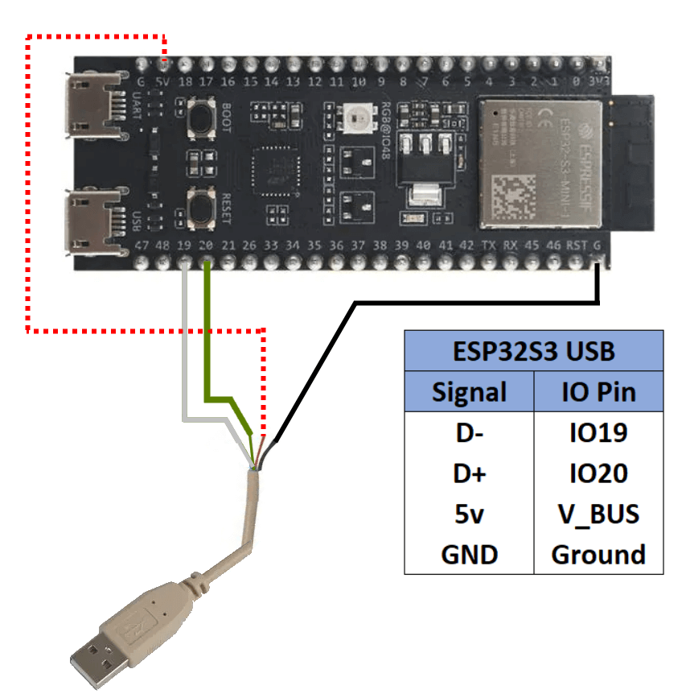

# ESP32-S3 USB Camera RTSP Streamer + MAVLink Telemetry

ESP32-S3 kartına bağlı USB kameradan görüntü alıp WiFi Access Point üzerinden RTSP protokolü ile yayınlayan ve aynı zamanda Pixhawk'tan MAVLink telemetri verilerini GCS'ye ileten embedded sistem projesi.

## 🎯 Özellikler

- **USB UVC Kamera Desteği**: Standart UVC uyumlu USB kameralar ile çalışır
- **WiFi Access Point**: 192.168.4.0/24 subnet'inde hotspot oluşturur
- **RTSP Streaming**: RFC 2326/3550 uyumlu RTSP/RTP server
- **MJPEG Format**: Yüksek uyumluluk için Motion JPEG
- **MAVLink Telemetri**: Pixhawk <-> GCS köprüsü (UDP 14550)
- **Çift Yönlü İletişim**: GCS komutları Pixhawk'a iletilir
- **Çoklu İstemci**: Aynı anda 4 RTSP + 4 GCS istemcisi
- **Otomatik Yeniden Bağlanma**: Kamera/Pixhawk çıkarılıp takıldığında otomatik devam

## 🔧 Donanım Gereksinimleri

- **ESP32-S3 DevKitC-1** veya benzeri (PSRAM'lı)
- **USB OTG Kablosu** (USB Host için)
- **USB UVC Kamera** (MJPEG destekli önerilir)
- **Pixhawk** veya ArduPilot uyumlu uçuş kontrolcüsü
- Güç kaynağı (USB kamera için yeterli akım)

### Sistem Diyagramı





### Bağlantı Şeması

```
ESP32-S3                    USB Kamera
---------                   ----------
GPIO19 (D-)  <----------->  D-
GPIO20 (D+)  <----------->  D+
5V           <----------->  VCC
GND          <----------->  GND

ESP32-S3                    Pixhawk (TELEM1/TELEM2)
---------                   -----------------------
GPIO17 (TX)  <----------->  RX
GPIO18 (RX)  <----------->  TX
GND          <----------->  GND
```

> ⚠️ USB kamera yüksek akım çekebilir (500mA+). Harici güç kaynağı önerilir.
> ⚠️ Pixhawk ile 3.3V sinyal seviyesi uyumludur, level shifter gerekmez.

## 📡 Ağ Yapılandırması

| Parametre | Değer |
|-----------|-------|
| SSID | ESP32-CAM-RTSP |
| Şifre | 12345678 |
| Gateway IP | 192.168.4.1 |
| Subnet Mask | 255.255.255.0 |
| DHCP Aralığı | 192.168.4.100 - 192.168.4.200 |
| RTSP Port | 554 |
| RTSP URL | rtsp://192.168.4.1:554/stream |
| MAVLink UDP | 14550 |

## 🚀 Kurulum

### 1. Gereksinimler

- [PlatformIO](https://platformio.org/) (VSCode eklentisi önerilir)
- [ESP-IDF](https://docs.espressif.com/projects/esp-idf/en/latest/) v5.0+

### 2. Projeyi Klonlayın

```bash
git clone https://github.com/your-repo/esp32-usb-cam-rtsp.git
cd esp32-usb-cam-rtsp
```

### 3. Derleyin ve Yükleyin

**PlatformIO ile:**
```bash
# Derleme
pio run

# Yükleme
pio run --target upload

# Serial monitor
pio device monitor
```

**ESP-IDF ile:**
```bash
idf.py set-target esp32s3
idf.py build
idf.py flash monitor
```

## 📺 Kullanım

### 1. ESP32-S3'ü Başlatın

Cihaz başladığında serial monitörde şu bilgileri göreceksiniz:

```
╔════════════════════════════════════════════╗
║      ESP32-S3 USB Camera RTSP Streamer     ║
╠════════════════════════════════════════════╣
║  WiFi AP:                                  ║
║    SSID: ESP32-CAM-RTSP                    ║
║    Pass: 12345678                          ║
║    IP:   192.168.4.1                       ║
╠════════════════════════════════════════════╣
║  RTSP Stream:                              ║
║    URL: rtsp://192.168.4.1:554/stream      ║
╚════════════════════════════════════════════╝
```

### 2. WiFi'ye Bağlanın

Telefonunuz veya bilgisayarınızdan **ESP32-CAM-RTSP** ağına bağlanın.

### 3. Stream'i İzleyin

**VLC Media Player ile:**
```
Media > Open Network Stream
URL: rtsp://192.168.4.1:554/stream
```

**FFplay ile:**
```bash
ffplay rtsp://192.168.4.1:554/stream
```

**GStreamer ile:**
```bash
gst-launch-1.0 rtspsrc location=rtsp://192.168.4.1:554/stream ! \
    rtpjpegdepay ! jpegdec ! autovideosink
```

**OpenCV (Python) ile:**
```python
import cv2

cap = cv2.VideoCapture('rtsp://192.168.4.1:554/stream')
while True:
    ret, frame = cap.read()
    if ret:
        cv2.imshow('ESP32 Camera', frame)
    if cv2.waitKey(1) & 0xFF == ord('q'):
        break
cap.release()
```

### 4. QGroundControl ile Telemetri

**QGroundControl Ayarları:**
1. QGroundControl'u açın
2. Application Settings > Comm Links
3. "Add" butonuna tıklayın
4. Ayarlar:
   - Name: ESP32-Pixhawk
   - Type: UDP
   - Port: 14550
   - Server Address: (boş bırakın)
5. "Connect" butonuna tıklayın

**Mission Planner Ayarları:**
1. Mission Planner'ı açın
2. Sağ üstteki bağlantı kutusundan "UDP" seçin
3. Port: 14550
4. "Connect" butonuna tıklayın

**MAVProxy ile:**
```bash
mavproxy.py --master=udp:192.168.4.1:14550
```

## ⚙️ Yapılandırma

`platformio.ini` dosyasındaki build flags ile ayarları değiştirebilirsiniz:

```ini
build_flags = 
    ; WiFi AP ayarları
    -DWIFI_AP_SSID=\"MyCamera\"
    -DWIFI_AP_PASS=\"mypassword123\"
    -DWIFI_AP_CHANNEL=11
    
    ; Kamera ayarları
    -DCAM_FRAME_WIDTH=1280
    -DCAM_FRAME_HEIGHT=720
    -DCAM_FPS=30
    
    ; RTSP ayarları
    -DRTSP_PORT=8554
    -DRTSP_STREAM_NAME=\"/live\"
    
    ; MAVLink ayarları
    -DMAVLINK_UART_NUM=1          ; UART numarası (0, 1, veya 2)
    -DMAVLINK_UART_TX_PIN=17      ; ESP32 TX -> Pixhawk RX
    -DMAVLINK_UART_RX_PIN=18      ; ESP32 RX -> Pixhawk TX  
    -DMAVLINK_UART_BAUD=115200    ; Baud rate (Pixhawk ile eşleşmeli)
    -DMAVLINK_UDP_PORT=14550      ; GCS UDP portu
```

### Pixhawk TELEM Port Yapılandırması

Pixhawk'ta telemetri portunu yapılandırmak için:

**ArduPilot için (Mission Planner):**
```
SERIAL1_PROTOCOL = 2 (MAVLink2)
SERIAL1_BAUD = 115
```

**PX4 için (QGroundControl):**
```
MAV_0_CONFIG = TELEM1
SER_TEL1_BAUD = 115200
```

## 📊 Performans

| Çözünürlük | FPS | Bant Genişliği |
|------------|-----|----------------|
| 640x480 | 30 | ~2-4 Mbps |
| 800x600 | 25 | ~3-5 Mbps |
| 1280x720 | 15 | ~4-8 Mbps |
| 1920x1080 | 10 | ~6-12 Mbps |

> Performans kamera modeline ve MJPEG sıkıştırma kalitesine göre değişir.

## 🔍 Sorun Giderme

### Kamera algılanmıyor
- USB OTG kablosunun doğru bağlandığından emin olun
- Kameranın UVC uyumlu olduğunu kontrol edin
- `lsusb` ile kameranın tanınıp tanınmadığını kontrol edin

### Stream açılmıyor
- WiFi bağlantısını kontrol edin
- Ping testi yapın: `ping 192.168.4.1`
- Firewall ayarlarını kontrol edin

### Düşük FPS
- Çözünürlüğü azaltın
- MJPEG formatını kullanın (YUV değil)
- Tek istemci ile test edin

### Bellek hatası
- PSRAM'ın aktif olduğundan emin olun
- Frame buffer sayısını azaltın
- Çözünürlüğü düşürün

### Pixhawk bağlanmıyor
- TX/RX kablolarının çapraz bağlandığından emin olun (ESP32 TX -> Pixhawk RX)
- Baud rate'in eşleştiğini kontrol edin (varsayılan 115200)
- Pixhawk'ta telemetri portunun MAVLink olarak yapılandırıldığını doğrulayın
- Serial monitörde heartbeat mesajları görünmeli

### QGroundControl bağlanmıyor
- WiFi'ye bağlı olduğunuzdan emin olun
- UDP portunu 14550 olarak ayarlayın
- Firewall'un UDP 14550'yi engellememediğinden emin olun
- "Autoconnect" seçeneğini devre dışı bırakıp manuel bağlanın

### Telemetri gecikmesi
- Baud rate'i artırın (921600 destekleniyorsa)
- Gereksiz telemetri stream'lerini Pixhawk'ta devre dışı bırakın
- WiFi kanalını daha az kalabalık bir kanala değiştirin

## 📁 Proje Yapısı

```
esp32-usb-cam-rtsp/
├── include/
│   ├── wifi_ap.h             # WiFi AP modülü
│   ├── usb_camera.h          # USB kamera modülü
│   ├── rtsp_server.h         # RTSP server modülü
│   ├── mavlink_telemetry.h   # MAVLink köprü modülü
│   └── mavlink_types.h       # MAVLink protokol tanımları
├── src/
│   ├── main.c                # Ana uygulama
│   ├── wifi_ap.c             # WiFi implementasyonu
│   ├── usb_camera.c          # USB kamera implementasyonu
│   ├── rtsp_server.c         # RTSP implementasyonu
│   └── mavlink_telemetry.c   # MAVLink implementasyonu
├── .vscode/                  # VSCode ayarları
├── platformio.ini            # PlatformIO yapılandırması
├── partitions.csv            # Partition tablosu
├── sdkconfig.defaults        # ESP-IDF varsayılanları
└── README.md                 # Bu dosya
```

## 📜 Lisans

MIT License - Özgürce kullanın ve geliştirin!

## 🤝 Katkıda Bulunma

1. Fork yapın
2. Feature branch oluşturun (`git checkout -b feature/amazing`)
3. Commit yapın (`git commit -m 'Add amazing feature'`)
4. Push yapın (`git push origin feature/amazing`)
5. Pull Request açın

## 📚 Referanslar

- [ESP-IDF Programming Guide](https://docs.espressif.com/projects/esp-idf/en/latest/)
- [USB Host Library](https://docs.espressif.com/projects/esp-idf/en/latest/esp32s3/api-reference/peripherals/usb_host.html)
- [RFC 2326 - RTSP](https://tools.ietf.org/html/rfc2326)
- [RFC 3550 - RTP](https://tools.ietf.org/html/rfc3550)
- [RFC 2435 - RTP Payload for JPEG](https://tools.ietf.org/html/rfc2435)
